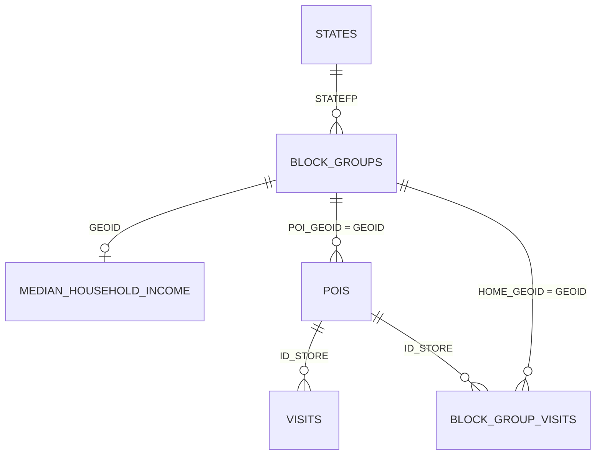

# sql - Weekly Patterns Plus tabular transformations

**Note:** This processing pipeline uses [DuckDB](https://duckdb.org/).

_Weekly Patterns Plus_ data and other data is transformed into a _somewhat_ normalized tabular structure.
Specifically, we use data from

- Weekly Patterns Plus by Advan Research
- Tiger/Line Shapefiles by United States Census Bureau
- [US State abbreviations and Fips codes](https://www.bls.gov/respondents/mwr/electronic-data-interchange/appendix-d-usps-state-abbreviations-and-fips-codes.htm) by U.S. Bureau of Labor Statistics
- 5-year ACS median household income estimates by United States Census Bureau

These sources are transformed into a structure with data about states, census block groups, POIs, and POI visits.

## Schema

## Tables

| Table | Grain | Description |
|---|---|---|
| `block_groups` | 1 row / block group | Census block group polygons (TIGER/Line 2025), keyed by `GEOID`. |
| `states` | 1 row / state | State polygon (`ST_Union_Agg` of its block groups), keyed by `STATEFP`, with `STATE` name and `ABBR`. |
| `median_household_income` | 1 row / block group | ACS 5-year median household income. |
| `pois` | 1 row / store (`ID_STORE`) | POIs: brand, address, category, lat/lon/geom, and `POI_GEOID` (the block group containing the POI). |
| `visits` | 1 row / POI / week | Weekly visit metrics: counts, dwell time, distance from home. |
| `block_group_visits` | 1 row / POI / week / home block group | `VISITOR_HOME_CBGS` unpacked (map → rows): visitor counts by home block group. |

