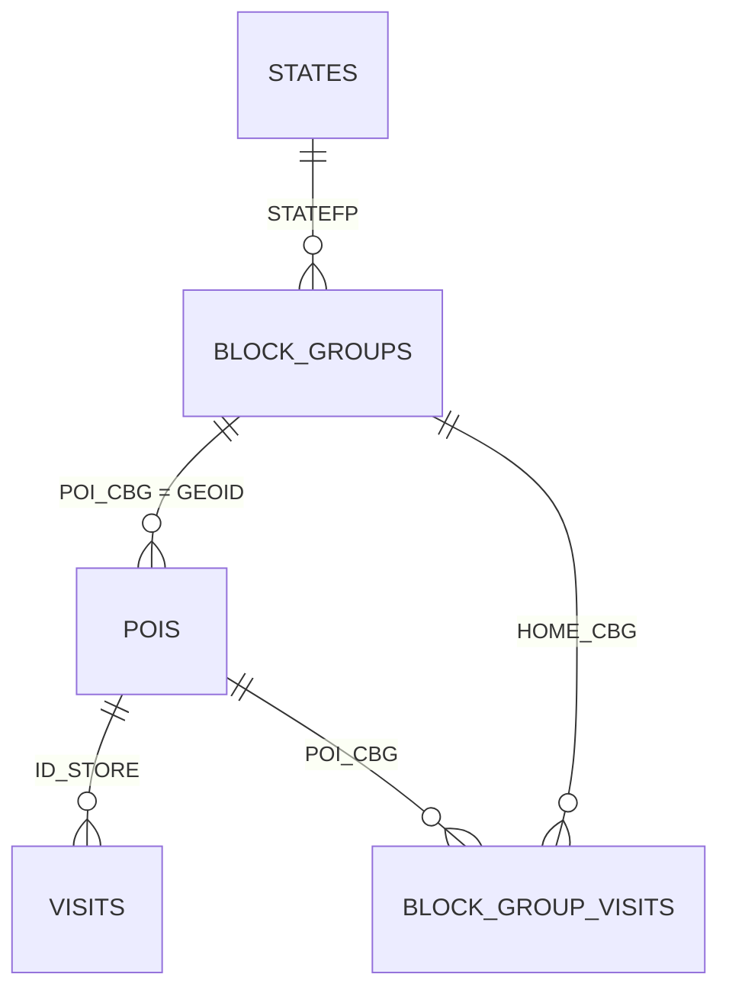

# sql - Weekly Patterns Plus tabular transformations

**Note:** This processing pipeline uses [DuckDB](https://duckdb.org/).

_Weekly Patterns Plus_ data and other data is transformed into a _somewhat_ normalized tabular structure.
Specifically, we use data from

- Weekly Patterns Plus by Advan Research
- Tiger/Line Shapefiles by United States Census Bureau
- [ US State abbreviations and Fips codes ](https://www.bls.gov/respondents/mwr/electronic-data-interchange/appendix-d-usps-state-abbreviations-and-fips-codes.htm) by U.S. Bureau of Labor Statistics

These sources are transformed into a structure with data about census blocks and POI visits.

## Schema

## Tables

| Table | Grain | Description |
|---|---|---|
| `states` | 1 row / state | State polygon (union of its block groups), FIPS + abbreviation |
| `block_groups` | 1 row / block group | Census block group polygons (TIGER/Line 2025), spatially indexed (RTREE) |
| `pois` | 1 row / store (`ID_STORE`) | Distinct POIs: brand, address, category, lat/lon/geom |
| `visits` | 1 row / POI / week | Weekly visit metrics: counts, dwell time, distance from home |
| `block_group_visits` | 1 row / POI / week / home CBG | `VISITOR_HOME_CBGS` unpacked (map → rows): visitor counts by home block group |

**Note:** `pois` and `visits` are built by reading all monthly `2025-weekly-patterns-plus/*.parquet` files with `union_by_name=false`, so all files must share identical schema.
